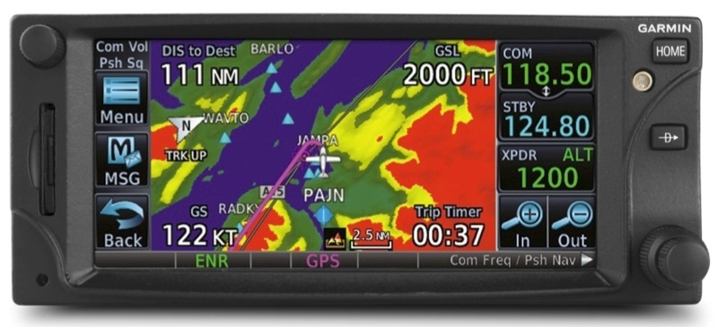
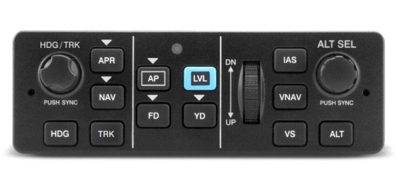

# OKY Upgrade

The May newsletter reported that there would be a push to repair the ailing autopilot during the 100 hourly service which was successful. There have been some problems reported with the Aspen however we are hopeful the aircraft will remain serviceable until the time when it goes in for the dashboard upgrade.

The project manager for the OKY upgrade, Rolf Blomstedt, led the specification and tender evaluation process for the upgrade. The contract to do the upgrade has been awarded to Avionics 2000 located at Essendon. Rolf will continue to be the key contact with the contractor throughout the upgrade.

All of the new electronics has now been received into store and has been paid for thanks to the share call. The current plan is for OKY to come off line on the 11th of November. The contractor has previously advised that the upgrade will take around six weeks. The date and the length of the work may need to change as detailed planning may reveal other constraints.

Members will find the new avionics has many similarities to the units being replaced so it will be easy to learn. But, of course, it is important to be very familiar with the instruments as it would not be safe to be learning while flying. So now is the time to be researching operating manuals, watching YouTube videos and accessing training to see how it all works. The specification of instruments is attached at the end of this document. Please type the Garmin model numbers into Google and YouTube to find user manuals and watch videos to find out more so you will be confident when the aircraft comes back after the upgrade.

There is something for everyone in the new equipment. People wanting the simple life will find the simplest of all of Garmin’s radios, the GTR 205 is installed as one of the two radios. Also to be installed is the GFC 500 which is an outstanding autopilot with a large number of features that will improve safe operations for VFR pilots hand operating the aircraft as well as for IFR pilots.

Read the following copied from the Garmin website to learn more about the radio and to see how the autopilot will operate in the background to provide stability protection for pilots hand flying the aircraft.

## GTN 650

The Garmin GTN650 is a cutting-edge navigation avionics system that brings advanced functionality and user-friendly design to the cockpit, making it an ideal upgrade for pilots familiar with the GNS430. This all-in-one GPS/NAV/COMM unit consolidates multiple functions into a single, compact device, simplifying cockpit management and enhancing situational awareness. With its intuitive touchscreen interface, the GTN650 offers a more modern and efficient user experience compared to the GNS430’s push-button controls. The high-resolution display provides clear, detailed mapping, ensuring pilots have the critical information they need to navigate safely, even in complex airspace.

One of the key advantages of the Garmin GTN650 is its comprehensive navigation capabilities, which far exceed those of the GNS430. The GTN650 supports a broader range of flight planning options, including direct-to navigation, airways, and advanced vertical navigation, enabling more efficient route planning. Additionally, it offers terrain awareness and warning systems that were not available on the GNS430, significantly enhancing safety by helping pilots avoid hazardous terrain. The GTN650’s compatibility with WAAS (Wide Area Augmentation System) also allows for precision approaches with accuracy comparable to ILS, which is a significant step up from the GNS430, especially for those flying in remote areas.

For pilots transitioning from the GNS430, the GTN650 offers enhanced communication features that make a noticeable difference in day-to-day operations. The built-in VHF COM radio with 10-watt transmit power ensures reliable communication across a wide range of frequencies, a crucial upgrade from the GNS430. The GTN650 also includes 8.33 kHz channel spacing, meeting the latest European airspace regulations, something the GNS430 lacks. Furthermore, the GTN650 integrates smoothly with other Garmin avionics and autopilot systems, creating a cohesive cockpit environment that enhances overall flight safety and efficiency. For GNS430 users, upgrading to the GTN650 provides not only more advanced features but also a more streamlined and modern flying experience.

The navigators in the Garmin GTN 650 XI and GNX375 share many similar features which can be
seen in a very large number of YouTube videos.



## Garmin GTR 205 radio

It is an extremely simple radio as navigation functions often seen on this type of instrument are located elsewhere on the dashboard.  
This link is to a video about the experimental version of the radio, which is very similar to our certified model, illustrates how easy the radio is to use.



Check out the [GNC215 Pilots Guide](https://www.aircraftspruce.com/catalog/pdf/gnc215_pilotsguide.pdf) to read the pilots guide which provides detailed instructions on how to use the advanced features. 

An overview of these features is described on the [Garmin website](https://www.garmin.com/en-US/p/721555).

## GFC 500

The upgrade will include the GFC 500 autopilot. The following information is from the Garmin
web site. The GFC 500 autopilot brings unprecedented levels of capability, reliability. GFC 500
leverages Garmin’s advanced attitude-based flight control technology to help prevent incidents
caused by loss of control, the FAA and other regulators encourage the use of key technologies, such
as angle-of-attack indicators and autopilots, to help increase situational awareness, reduce pilot
workload and enhance safety of flight. The GFC 500 incorporates a number of safety-enhancing
technologies, including Garmin ESP, under-speed and over-speed protection, automatic LVL mode,
vertical navigation (VNAV) mode, flight director (FD) command cues and more.  



GFC 500 provides crisp, precise response and optimum performance over the entire airspeed
envelope of your aircraft. Rather than depending on failure-prone mechanical gyros, the GFC 500
system is digitally controlled, using solid-state attitude and air data sensor reference — giving you
ultra-smooth roundouts, intercepts and more while also enhancing the reliability of the system.
Incorporating the highly adaptable GI 275 electronic flight instrument, a mode controller and “smart”
servos, the autopilot’s architecture supports full pitch-and-roll axis control capabilities with optional
pitch trim for automatic and manual electric trim. Additionally, yaw damper capability is optionally
available for select aircraft models.  

GFC 500 supports a wide range of precision, non-precision and GPS-guided approaches as well as
holds, procedure turns, missed approaches and more. GFC 500 also includes built-in GPS roll steering
capability, which allows smoother navigation tracking and eliminates the need for external roll
steering converters. Flight director cues are displayed as command bars on the GI 275 electronic
flight instrument. The command bars are always in view when the autopilot is doing the flying — and
may also be used for visual guidance when you’re hand-flying the aircraft. With support for a
remotely installed Takeoff/Go-around (TOGA) button, the flight director can be cued to automatically
indicate and capture the correct pitch attitude required to fly a missed approach and then follow the
missed approach procedure loaded in your compatible GPS navigator.  

### Mode Control at Your Fingertips  

A mode controller is included with your GFC 500 package, and its compact size and mark-width
design require only minimal space in your avionics stack while providing easy access to all autopilot
modes and functions. You can select advanced lateral and vertical modes such as pitch hold, altitude
preselect, altitude hold, vertical speed and indicated airspeed hold as well as roll, track and selected
heading. An intuitive control wheel integrated into the GFC 500 mode controller allows for easy and
precise pitch, vertical speed and airspeed adjustments, while separate knobs allow quick twist
control of heading and altitude. For added safety, a dedicated LVL button on the controller lets you
command the autopilot to automatically return your aircraft to straight-and-level flight — and thus
help avert a potential loss-of-control situation.  

### Silky-smooth Servo Control

For maximum reliability and safety, the GFC 500 servos incorporate brushless DC motors and a gear
train that eliminates the need for a mechanical slip clutch and shear pins. This design results in
enhanced system efficiency — while also reducing maintenance/inspection requirements. The servos
also provide virtually no control system friction with the autopilot turned off, decoupling the motor
drives so you can easily hand-fly or override the system without fighting the controls. The servos
weigh only 1.4 lbs each, making them more than 40% lighter than most other autopilot servos of
their class. Each servo is operated by its own built-in microprocessor, which provides the “smart”
logic to significantly improve sensor performance, response and self-monitoring capabilities — while
simplifying overall system configuration and installation.

### Hand-fly with Stability Protection

Any pilot who’s ever been startled to attention by a stall warning horn in a busy cockpit will
appreciate the proactive stability augmentation of our ESP technology, which is standard on the GFC
500 system. When the aircraft is being hand-flown, this ESP feature functions independently of the
autopilot — although it uses the same control servos — to nudge the controls toward stable flight
whenever pitch or roll deviations exceed the recommended limits or underspeed/overspeed
conditions occur. After the system detects that it has been activated for a specified period of time,
the autopilot will engage with the flight director in level mode, bringing the aircraft back to level
flight and helping to avoid the onset of inadvertent stall/spins, steep spirals or other loss-of-control
scenarios. Additionally, ESP can be manually disabled to allow for intentional flight maneuvers.

Plus, pairing GFC 500 with a GTN Xi series navigator enhances our Smart Glide™ technology for
emergency engine power loss situations. Once Smart Glide is activated, GFC 500 automatically
activates IAS mode at best glide speed and flies the generated route near the airport so the pilot can
land.

### An Autopilot Knows Its Limits
With the autopilot engaged, GFC 500 also provides overspeed and underspeed protection. In a high
airspeed situation — for example, if you’re descending and your aircraft is approaching VNE or VMO
— the system will increase the aircraft’s pitch attitude, preventing a further increase in airspeed and
potential structural damage. Likewise, at the other end of the speed spectrum, GFC 500 provides
underspeed (stall) protection. For example, in the event the pilot does not immediately advance the
throttle to full power, with the autopilot engaged while flying a missed approach sequence, the autopilot will help prevent an aircraft stall by reducing pitch attitude and provide the pilot with an “airspeed, airspeed” audible alert.

### It’s a Total Peace-of-mind Investment
There is no substitute for a safe and vigilant pilot. But there are times when a “helping hand” at the
controls can have a significant impact on the safety, comfort and enjoyment of your flight.

# OKY Upgrade - Specification

The following is the amended specification for the upgrade of OKY. Search on the web using the model numbers to learn more about them.

**New (Garmin) Equipment:**

- [GI275](https://www.garmin.com/en-US/p/719027/pn/010-GI275-00) ADAHRS w/GMU11
- [GFC 500 Autopilot](https://www.garmin.com/en-US/p/604257/pn/GFC-500AP-00) 3 servos Pitch/Roll/Pitch Trim inclusive of GMC 507, Yoke trim switch and Smart Glide button on the panel
- [GTN650XI](https://www.garmin.com/en-US/p/606906/pn/010-01999-05) Black GPS/NAV/COM incl of data card/databases
- [GNX375](https://www.garmin.com/en-US/p/577174/pn/010-01823-01) Transponder/GPS
- [GTR205](https://www.garmin.com/en-US/p/721555/pn/010-02480-01) COM
- [GSB15](https://www.garmin.com/en-US/p/647247/pn/010-02201-10) USB charger
- TCW Standby Power 24V 3Ah, for COM and GPS back up

**Keep & reuse from existing panel:**

- GMA340 Audio Panel
- GI275
- Clock with USB
- Airspeed Indicator
- Altimeter
- Air time switch/counter (Hobbs)
- All engine related instruments

**Remove and trade in from existing panel:**

- Aspen Evolution EFD1000 PFD
- 2 x Garmin 430W
- S-TEC 50 Autopilot
- T&B Gyro/indicator
- CD Player

**Comments:**

- Use existing panel and add cover plates where instruments are removed
- Install the two GI275 in Aspen location (will require a cover plate)
- ADSB IN to be displayed on GTN650XI, GNX375 & GI275 and audio warning for traffic.